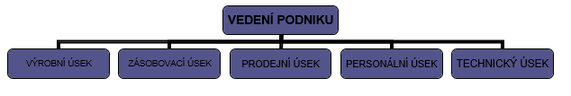
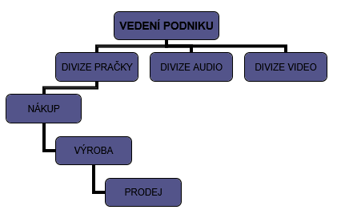
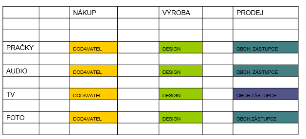

1. Plánování - pojem, dělení
  - **stanovení cílů, cest a prostředků k jejich dosažení**
  - dělení
    - **Strategické** - stanovení hlavního cíle
    - **Taktické** - střednědobé (rok)
    - **Operativní** - (měsíce, týdny, dny)

2. Organizování - pojem, delegování
  - **uspořádání činností**
  - **delegování** - přidělování úkolů a práce jednotlivcům

3. Organizační struktury pro organizování činností - přehled, charakteristika
  - **úseková struktura** - členění podle obsahu na odborné úseky
    - 
  - **výrobková struktura** - členění podle jednotlivých výrobků
    - 

4. Organizování podle rozdělení pravomocí a odpovědnosti - přehled, struktura
  - liniová struktura
    - každý zaměstnanec má pouze **jednoho nadřízeného**
  - funkcionální struktura
    - zaměstnanec podléhá **několika nadřízeným podle odbornosti**
  - liniově - štábní struktura
    - **vedoucí má poradní spolupracovníky** (poskytují odbornou pomoc)
  - maticová struktura
    - každý zaměstnanec má **2 i více nadřízených** (např. u velkých projektů)
    - 

5. Organizační dokumenty
  - **organizační řád** - členění podniku
  - **popisy funkčních míst** - vymezuje jednotlivé funkce
  - **pracovní řád** - práva a povinnosti zaměstnanců

6. Rozhodování - pojem, předpoklady
  - znamená výběr řešení z několika variant
  - **předpoklady**
    - osobnostní předpoklady
    - zkušenost, praxe
    - odborný trénink

7. Motivace - pojem, dělení
  - poskytuje vnitřní zdůvodnění, proč pracovat a jak pracovat co nejkvalitněji
  - **dělení**
    - **pozitivní** - odměny, benefity, pochvaly
    - **negativní** - obavy, napětí z postihů, případně ztráta zaměstnání

8. Manažerské styly vedení
  - **autokratický** - rozhoduje sám
  - **demokratický** - o problémech diskutuje
  - **liberální** - vytváří podmínky pro práci

9. Kontrola - pojem, druhy
  - zpětná vazba pro odpovědné pracovníky -> přijímají odpovídající opatření
  - **druhy**
    - úplná, částeěná, preventivní, průběžná, následná

8. Audit - význam, dělení
  - nápravná opatření
  - vnitřní - interní nestranné pozorování
  - vnější - nezávislá osoba mimo podnik
  
